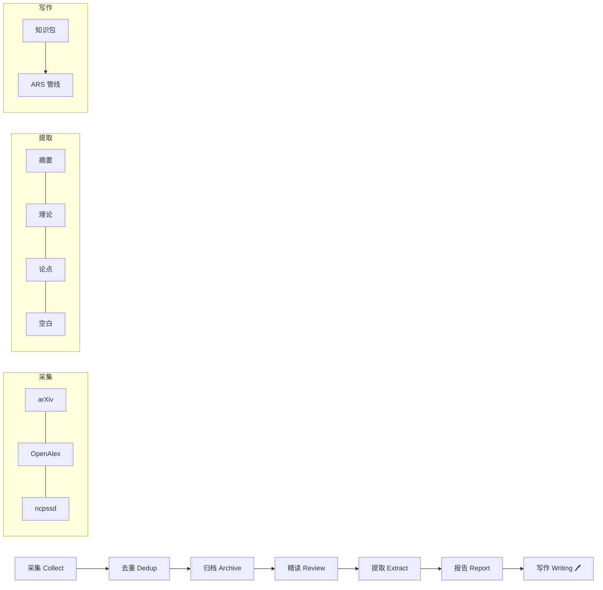

<div align="center">

# 🛠️ PaperFlow

**可移植的学术文献管理 + AI 论文写作 CLI 管线**

[]()
[]()
[]()
[]()

**零外部服务依赖。** Clone 即用，替换关键词即可适配任何学科。

> 脱胎于一个已运行 115 篇精读报告的公共管理知识库，所有设计经过实际检验。

</div>

---

## 📋 目录

- [项目背景](#项目背景)
- [快速开始](#快速开始)
- [管线概览](#管线概览)
- [项目结构](#项目结构)
- [关键设计](#关键设计)
- [ARS 写作集成](#ars-写作集成)
- [换领域指南](#换领域指南)
- [技术栈与致谢](#技术栈与致谢)
- [版本历史](#版本历史)

---

## 项目背景

学术研究中，论文从 **采集 → 精读 → 提取 → 报告** 的全流程管理是一个普遍需求。本框架将这一流程标准化为可复用的 CLI 技能集——任何人 clone 后替换关键词即可用于自己的领域。

### 解决的核心问题

| 问题 | 方案 |
|:-----|:------|
| 换新领域从零开始 | 改一个配置文件，获得完整的运行管线 |
| PDF 散落无序 | 标准化命名 + SQLite 去重 + Zotero 归档 |
| 阅读笔记丢失 | 结构化精读 → 自动提取跨篇素材 |
| AI 写作脱离积累 | 知识注入管线将数据库沉淀注入论文写作各阶段 |

---

## 快速开始

```bash
# 1. 克隆
git clone https://github.com/cbzhang86/academic-knowledge-base.git
cd academic-knowledge-base    # 切换到 framework 分支

# 2. 初始化（选择归档后端）
python skills/global_config.py init --backend filesystem

# 3. 配置你的领域（改一个文件）
vim config/areas.yaml               # 替换关键词和采集源

# 4. 查看状态
python skills/pipeline.py status

# 5. 开始使用
# 手动拖入 PDF 自动处理：
python skills/review/watcher.py --once

# 或自动采集：
python skills/collect/search.py "关键词" --direction 你的方向 --limit 3
```

---

## 管线概览



| 步骤 | 命令 | 产出 |
|:-----|:-----|:-----|
| **采集** | `search.py "关键词" --direction X` | 标准化命名的 PDF 文件 |
| **去重** | `dedup.py rebuild && dedup.py status` | SQLite 索引（MD5 + 标题） |
| **归档** | `archive.py` | 登记到所选后端 |
| **精读** | `draft.py` + `check.py` | v10 格式精读报告 |
| **提取** | `regenerate.py` | 跨篇沉淀素材 |
| **报告** | `daily.py` / `weekly.py` / `monthly.py` | 自动生成报告 |
| **写作** | `ars_bridge.py` + `format_cn.py` | 论文起草与格式化 |

---

## 项目结构

```
skills/                   ← 所有 CLI 命令
├── collect/              采集（搜索 + 下载）
│   ├── search.py         多源调度（自动判断中文/英文源）
│   ├── arxiv.py          arXiv API
│   ├── openalex.py       OpenAlex API
│   └── fetch.py          DOI → PDF 解析器
├── metadata/             元数据
│   ├── dedup.py          SQLite 去重引擎
│   ├── archive.py        归档调度器
│   └── backends/         插件式归档后端
│       ├── filesystem/   默认（零依赖）
│       └── zotero/       可选（需 Zotero 桌面端）
├── review/               精读
│   ├── watcher.py        文件监控 → 自动起草
│   ├── draft.py          PDF → 精读草稿
│   └── check.py          模板合规检查
├── extract/              提取
│   ├── regenerate.py     跨篇沉淀再生
│   └── keywords.py       关键词池生成
├── report/               报告 + 论文写作工具
│   ├── daily.py          日报
│   ├── weekly.py         周报
│   ├── monthly.py        月报
│   ├── starter.py        研究启动器
│   ├── ars_bridge.py     ARS 知识注入桥接
│   ├── create_formatted_docx.py  .docx 格式化（5种模板）
│   └── ars_pipeline_checklist.py  启动前环境检查
├── tools/sync.py         Obsidian 同步
├── pipeline.py           流水线仲裁器
└── global_config.py      统一配置入口

config/                   ← 你的配置在这里
├── areas.yaml            领域关键词（换领域改这里）
├── structure.yaml        目录映射
├── sources.yaml          采集源定义
├── template.yaml         校验规则
└── metadata.yaml         归档后端选择（init 生成）

docs/                     ← 文档
├── agents/               5 个 Agent 角色定义
├── getting-started.md    快速上手
└── architecture.md       架构说明

templates/                模板
└── reading-report.md     v10 精读报告模板
```

---

## 关键设计

### 去重引擎

所有论文去重使用本地 SQLite（`config/dedup.db`），**不论归档后端选什么**。

```bash
python skills/metadata/dedup.py rebuild   # 全量重建索引
python skills/metadata/dedup.py status    # 查看统计
python skills/metadata/dedup.py check     # 检查标题列表
```

- MD5 内容指纹 + 标题归一化双匹配
- `zotero_imported` 标记（Zotero 后端专用）
- 支持从旧 `done.sqlite` 迁移

### 插件式归档后端

```python
class MyBackend(ArchiveBackend):
    def _do_archive(self, pdf_path, paper_info) -> dict:
        # 实现归档逻辑
        ...
    @classmethod
    def detect(cls, project_root) -> bool:
        # 检测环境是否支持
        ...
```

内置：`filesystem`（零依赖）、`zotero`（可选）。放在 `metadata/backends/` 下自动发现。

### 流水线仲裁器

```bash
python skills/pipeline.py run                            # 全流程
python skills/pipeline.py run --from extract --to report # 局部执行
python skills/pipeline.py status                         # 完整性检查
```

阶段依赖图：`config → collect → dedup → archive → review → extract → report`。单篇论文失败不影响其他论文。

### 多 Agent 角色

每个 Agent = prompt 模板 + Skill 调用规则，可移植到任何 AI 工具。

| Agent | 职责 | 使用 Skill |
|:------|:------|:-----------|
| **采集Agent** | 制定策略 → 搜索 → 去重 → 下载 → 归档 | `collect/*`, `metadata/dedup`, `metadata/archive` |
| **精读Agent** | 读 PDF → v10 模板写精读 → 自查 | `review/draft`, `review/check` |
| **审稿Agent** | 审核报告 → 7 维评分 → 要求修订 | `review/check` |
| **综合Agent** | 跨篇对比 → 发现空白 → 生成报告 | `extract/regenerate`, `report/*` |
| **运维Agent** | 完整性检查 → 备份 → Obsidian 同步 | `tools/sync`, `metadata/dedup` |

---

## ARS 写作集成

本框架与 [academic-research-skills](https://github.com/Imbad0202/academic-research-skills) 通过 **知识注入管线** 集成：

```bash
# 1. 从研究想法生成原料包
python skills/report/starter.py "研究想法" --direction 方向

# 2. 生成各阶段知识包
python skills/ars_bridge.py stage-3 --topic "主题" --paper "论文名"
python skills/ars_bridge.py stage-5 --refs "引文1,引文2" --paper "论文名"

# 3. 格式化为中文学术 .docx（5 种模板）
python skills/report/create_formatted_docx.py convert \
  -i 终稿.md -o 终稿_学报版.docx --style 学报

# 4. 启动前环境检查
python skills/report/ars_pipeline_checklist.py -d 初稿.md
```

> ⚠️ **已知限制**：使用 ARS 时 Claude Code 需锁定 v2.1.165（v2.1.166+ 会导致 Agent API 400 错误）

---

## 换领域指南

### 改一个文件就行

```yaml
# config/areas.yaml
areas:
  计算机科学:                    # ← 新增领域，加一段
    keywords: ["deep learning", "transformer", "大模型"]
    sources: ["arxiv", "openalex"]
  社会学:
    keywords: ["社会分层", "代际流动"]
    sources: ["openalex", "ncpssd"]
```

### 改目录名（可选）

```yaml
# config/structure.yaml
directories:
  01_raw: "01_论文原文"        # → 改为 "01_raw_papers"
  02_reports: "02_精读报告"     # → 改为 "02_reading_reports"
```

### 归档后端

| 后端 | 依赖 | 说明 |
|:-----|:------|:------|
| `filesystem` | 无（默认） | 零依赖，clone 即用 |
| `zotero` | Zotero 桌面端 | 自动写入 Zotero SQLite |
| `feishu` | 预留 | 飞书云文档 |
| `notion` | 预留 | Notion API |

首次运行 `python skills/global_config.py init` 交互式选择，也支持 `--non-interactive` 和 `METADATA_BACKEND` 环境变量。

---

## 技术栈与致谢

### 核心依赖

| 工具 | 用途 |
|:-----|:------|
| Python 3.11+ | 所有 CLI 命令运行环境 |
| SQLite3 | 去重引擎（标准库自带） |
| PyMuPDF | PDF 文本提取 |
| watchdog | 文件变更监控 |
| python-docx | .docx 格式化输出 |

### 外部项目致谢

本项目基于以下优秀开源项目构建：

- **[academic-research-skills](https://github.com/Imbad0202/academic-research-skills)**（MIT License）— 论文写作全流程工具，通过 `report/starter.py` + `report/ars_bridge.py` 集成
- **[evil-read-arxiv](https://github.com/juliye2025/evil-read-arxiv)**（MIT License）— 论文阅读自动化工作流，参考了其 Agent 角色设计
- **[paper-fetch](https://github.com/chentiangemalc/paper-fetch)** — 多源 DOI→PDF 批量下载

### 采集源致谢

- **国家哲学社会科学文献中心（ncpssd.cn）** — 中文 CSSCI 论文开放获取平台
- **arXiv.org** — 开放获取预印本仓库
- **OpenAlex.org** — 开放学术信息索引

---

## 版本历史

| 版本 | 日期 | 要点 |
|:----:|:----:|:------|
| **v10.5** | 2026-06-10 | 新增 4 条铁律 · 批量写作流程 · 日常维护清单 |
| **v10.3** | 2026-06-10 | 自检机制 · Agent 映射 · Zotero 对齐 |
| **v10.2** | 2026-06-10 | 中文学术格式转换 · ARS 环境检查 |
| v10 | 2026-06-09 | 全面重构：v10 格式 · 跨篇沉淀 · Obsidian 全同步 |
| v1~v9 | 2026-04~06 | 前期建设与迭代 |

---

<div align="center">

**知识不只为人类阅读，也为 AI 写作时可用。**

</div>
